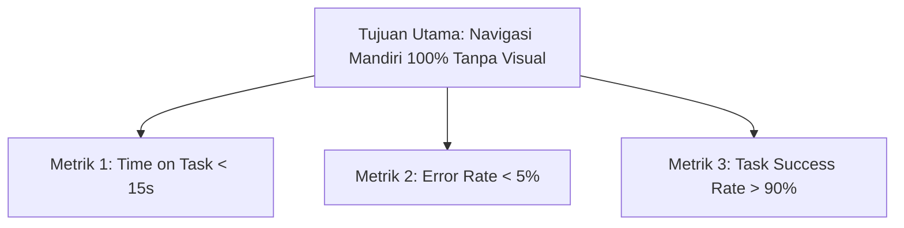
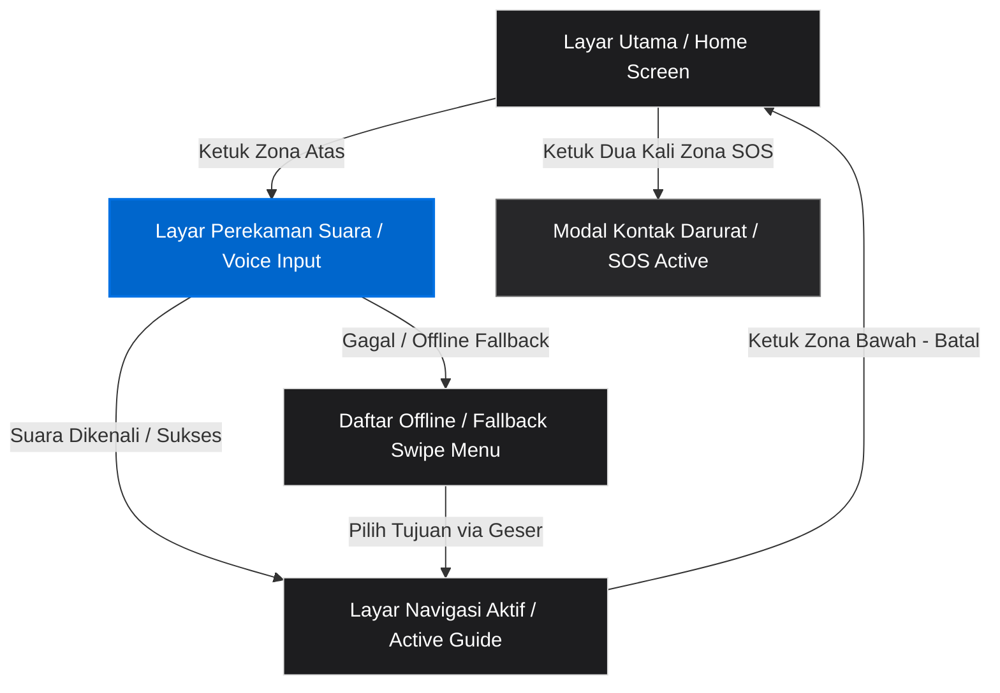

# Product Requirements Document (PRD) — KampusGuide Access
**Versi:** 2.0 (Edisi Detail Aksesibilitas Mobile & Apple Design Integration)  
**Nama Produk:** KampusGuide Access  
**Platform:** Aplikasi Mobile (Android/iOS)  
**Disusun Oleh:** Sultan Hamdi Jailani Daulay  
**Target Implementasi:** Lingkungan Kampus Institut Teknologi Sepuluh Nopember (ITS)  

---

## 1. Ringkasan Eksekutif (Executive Summary)

**KampusGuide Access** adalah aplikasi asisten navigasi personal berbasis *mobile* yang dirancang khusus untuk mahasiswa dan pengunjung kampus penyandang disabilitas netra (tunanetra total) dan *low vision* di lingkungan Institut Teknologi Sepuluh Nopember (ITS). 

Navigasi mandiri di area kampus yang luas dan kompleks sering kali menjadi hambatan besar bagi penyandang disabilitas netra. Peta visual konvensional tidak berguna bagi mereka, sementara aplikasi navigasi umum seperti Google Maps tidak memiliki akurasi tingkat pedestrian (jalur pedestrian, selasar gedung, tangga, dan ramp). 

Aplikasi ini memecahkan masalah tersebut dengan menyajikan antarmuka **Voice-First (Berbasis Suara)**, **Haptic Feedback (Getaran Spasial)**, dan panduan suara **Turn-by-Turn** yang presisi. KampusGuide Access mengadopsi prinsip desain premium dari **Apple Design Guidelines** (adaptasi dari `DESIGN-apple.md`) yang difokuskan sepenuhnya pada kesederhanaan, kontras super-tinggi, tipografi bersih, dan target sentuh berukuran raksasa (*extreme touch targets*) untuk menjamin pengoperasian tanpa visual.

---

## 2. Tujuan & Metrik Keberhasilan (IMK & UX)

Aplikasi ini menargetkan kepuasan interaksi manusia dan komputer (IMK) yang luar biasa bagi kelompok pengguna berkebutuhan khusus.



### Metrik Keberhasilan Detail:
1. **Time on Task (Efisiensi):** Pengguna tunanetra dapat membuka aplikasi dan memulai rute navigasi baru menggunakan input suara dalam waktu rata-rata **kurang dari 15 detik**.
2. **Error Rate (Akurasi Sentuh):** Tingkat kesalahan salah tekan (*misclick*) di bawah **5%**. Hal ini dicapai dengan membagi layar mobile menjadi 2-3 zona sentuh raksasa, sehingga meniadakan kebutuhan akan penargetan jari yang presisi.
3. **Task Success Rate (Kemandirian):** Rata-rata **90%** partisipan pengujian (tunanetra total) berhasil mencapai gedung tujuan di ITS (misalnya, dari Departemen Informatika ke Perpustakaan Pusat) secara mandiri tanpa intervensi fisik dari pendamping.
4. **Cognitive Load (Beban Kognitif):** Pengguna melaporkan tingkat stres rendah (skor NASA-TLX kategori beban mental di bawah 30%) selama proses navigasi berlangsung.

---

## 3. Profil Pengguna (User Persona)

Desain aplikasi berfokus pada dua kelompok persona utama dengan kebutuhan aksesibilitas yang spesifik:

### Persona Utama (Primary Persona): Tunanetra Total (Blind)
* **Profil:** Mahasiswa Departemen Informatika ITS.
* **Karakteristik Pengoperasian:**
  * Menggunakan *smartphone* dengan sistem pembaca layar (*screen reader* aktif seperti TalkBack pada Android atau VoiceOver pada iOS).
  * Tidak menggunakan visual sama sekali; mengandalkan indra pendengaran (audio) dan peraba (haptik/getaran).
  * Memiliki memori spasial yang kuat tetapi membutuhkan konfirmasi jarak dan orientasi arah yang presisi.
* **Kebutuhan Utama:**
  * Navigasi suara *turn-by-turn* yang memberikan instruksi fisik spesifik ("Maju", "Tangga di depan", "Belok kanan").
  * Pola getaran (*haptic*) sebagai konfirmasi arah tanpa harus selalu memakai *earphone*.
  * Struktur layar yang konsisten sehingga tata letak tombol dapat diprediksi dengan memori otot (*muscle memory*).

### Persona Sekunder (Secondary Persona): Low Vision & Lansia
* **Profil:** Dosen Tamu atau Orang Tua Mahasiswa yang berkunjung ke ITS.
* **Karakteristik Pengoperasian:**
  * Memiliki sisa penglihatan yang sangat terbatas (*low vision*), sensitif terhadap silau, atau mengalami penurunan ketajaman visual.
  * Tidak menggunakan TalkBack secara penuh, melainkan mengandalkan pembesaran teks (*zoom*) dan kontras warna yang ekstrem.
* **Kebutuhan Utama:**
  * Kontras warna yang sangat tinggi antara teks dan latar belakang (rasio kontras minimal 7:1).
  * Tipografi berukuran besar (minimal 24sp hingga 40sp) dengan tipe huruf sans-serif yang bersih (SF Pro Display).
  * Tidak ada gradasi warna dekoratif atau bayangan pada komponen UI yang dapat mengaburkan teks.

---

## 4. Kebutuhan Fungsional (Functional Requirements)

Fungsi utama aplikasi harus berjalan mulus dengan detail alur interaksi sebagai berikut:

| ID | Fitur | Detail Spesifikasi Fungsional | Skema Respons Sistem |
| :--- | :--- | :--- | :--- |
| **F1** | **Pencarian Suara (Voice-First Search)** | Pengguna mengetuk zona atas layar (50% luas layar) satu kali untuk merekam suara. Sistem merekam ucapan tujuan (misal: "Tunjukkan jalan ke ruang kelas 203 Departemen Sistem Informasi"). | Mengirim audio ke API Speech-to-Text (integrasi Gemini API). Jika sukses, langsung mengarahkan ke halaman navigasi aktif. |
| **F2** | **Panduan Audio Turn-by-Turn** | Memberikan panduan suara secara berkala mengenai arah, jarak, dan tindakan. Contoh: "Maju lurus 12 meter, lalu belok kanan di pertigaan selasar." | Menggunakan mesin *Text-to-Speech* (TTS) bawaan OS. Prioritas audio diatur agar tidak bertabrakan dengan TalkBack. |
| **F3** | **Umpan Balik Haptik (Spasial)** | Mengeluarkan pola getaran motor *smartphone* sebagai sinyal arah taktil agar pengguna tetap waspada tanpa suara. | - **1 Getaran Pendek (0.2s):** Tetap Lurus<br>- **2 Getaran Pendek (0.2s x2):** Belok Kanan<br>- **1 Getaran Panjang (0.6s):** Belok Kiri<br>- **Getaran Berulang:** Tiba di Tujuan |
| **F4** | **Informasi Landmark & Rintangan** | Deteksi otomatis posisi pengguna terhadap koordinat penting (selasar kantin, pintu masuk, tangga, jalan tidak rata). | Menyebutkan suara secara otomatis: "Anda melewati selasar Mushola Departemen Informatika di sebelah kiri Anda." |
| **F5** | **Tombol Darurat (SOS One-Tap)** | Tombol khusus di area bawah kanan yang ketika ditekan lama (atau ketuk dua kali cepat) akan langsung menghubungi SKK ITS dan mengirimkan tautan lokasi koordinat GPS secara SMS/data. | Memicu panggilan telepon langsung (direct call `tel://`) dan memicu integrasi SMS darurat otomatis. |

---

## 5. Arsitektur Navigasi & Alur Layar Mobile

Untuk mengurangi beban kognitif pengguna tunanetra, KampusGuide Access menggunakan **Hierarki Navigasi Dangkal (Shallow Navigation)** yang terdiri dari maksimal 2 level kedalaman layar. Tidak ada menu burger (*hamburger menu*), tidak ada dropdown, dan tidak ada tab navigasi yang membingungkan.

### Peta Alur Layar (Screen Flow Map)



---

## 6. Desain Antarmuka Mobile (Fokus Aksesibilitas & Apple Style)

Berdasarkan analisis panduan desain Apple (`DESIGN-apple.md`), kita memformulasikan tampilan mobile KampusGuide Access yang premium namun sangat aksesibel bagi tunanetra dan low vision.

### A. Palet Warna & Kontras Tinggi (Color Token System)
Sesuai panduan Apple, kita membatasi penggunaan warna. Tidak ada gradasi dekoratif, tidak ada bayangan pada elemen UI, dan hanya menggunakan satu warna interaktif utama untuk menjaga konsistensi visual bagi pengguna *low vision*.

* **Latar Belakang Utama (Canvas):** `#000000` (Pure Black). Memberikan kenyamanan maksimal bagi penderita *low vision* (bebas silau) dan menghemat daya baterai pada layar OLED/AMOLED mobile.
* **Warna Teks Utama:** `#ffffff` (Pure White). Digunakan untuk teks instruksi navigasi utama.
* **Warna Teks Sekunder/Status:** `#ffff00` (Yellow/Kuning Kontras Tinggi). Digunakan untuk peringatan rintangan (tangga, belokan tajam) karena warna kuning pada latar belakang hitam memiliki tingkat keterbacaan (*readability*) tertinggi bagi mata manusia dengan ketajaman rendah.
* **Warna Aksi Utama (Action Blue):** `#0066cc`. Digunakan sebagai indikator visual tombol aktif (misalnya tombol "Mulai Navigasi" atau "SOS").
* **Warna Peringatan Darurat (SOS):** `#ff453a` (Apple System Red). Digunakan khusus pada tombol SOS.
* **Warna Latar Belakang Panel/Kartu (Parchment on Dark):** `#272729` (Near-Black Tile 1). Digunakan untuk memisahkan zona sentuh secara taktil visual.

### B. Tipografi Aksesibilitas (Typography Scale)
Menggunakan keluarga huruf `SF Pro Display` (untuk tajuk) dan `SF Pro Text` (untuk tubuh/keterangan) dengan tracking rapat khas Apple (*negative letter-spacing*) untuk visual yang kokoh. Ukuran teks diperbesar secara ekstrem:

| Token Desain | Ukuran Font | Weight | Letter Spacing | Fungsi / Penempatan |
| :--- | :--- | :--- | :--- | :--- |
| `{typography.hero-guide}` | 40px | 600 (Bold) | -0.374px | Instruksi Navigasi Utama (misal: **"LURUS 10m"**) |
| `{typography.lead-guide}` | 24px | 400 (Regular) | 0 | Sub-instruksi / Nama Jalan saat ini |
| `{typography.button-giant}` | 20px | 600 (Bold) | -0.224px | Teks label pada tombol sentuh besar |
| `{typography.fine-print-guide}`| 14px | 400 (Regular) | -0.12px | Detail legalitas GPS / Status Baterai di footer |

---

### C. Pembagian Tata Letak Layar Mobile (Grid & Target Sentuh)

Layar perangkat mobile (rasio umum 16:9 atau 19.5:9) dibagi menjadi area-area sentuh raksasa. Hal ini bertujuan agar pengguna tunanetra cukup menempelkan jempol mereka di area atas, bawah, atau samping layar untuk memicu fungsi tanpa perlu mencari tombol kecil.

#### Layout 1: Layar Utama (Home Screen)
Layar ini dirancang untuk segera memulai pencarian rute.

```
+--------------------------------------------+
| [Status GPS: Akurat | Baterai: 80%] (14px)  |
+--------------------------------------------+
|                                            |
|                                            |
|                ZONA ATAS                   |
|                 (50%)                      |
|                                            |
|           [ LOGO MIKROFON ]                |
|         KETUK DI SINI & KANTONGI           |
|            UNTUK MULAI SUARA               |
|                                            |
|                                            |
+---------------------+----------------------+
|     ZONA KIRI       |      ZONA KANAN      |
|       (25%)         |        (25%)         |
|                     |                      |
|     FAVORIT /       |      DARURAT         |
|      OFFLINE        |        SOS           |
|      (Swipe)        |    (Ketuk 2x)        |
+---------------------+----------------------+
```

* **Spesifikasi Zona Sentuh:**
  * **Zona Atas (Mulai Navigasi):**
    * Tinggi: 50% dari tinggi layar perangkat.
    * Latar belakang: `#0066cc` (Action Blue).
    * Deskripsi Pembaca Layar (*Content Description*): *"Tombol Cari Tujuan. Ketuk satu kali untuk mulai berbicara."*
  * **Zona Bawah Kiri (Daftar Favorit/Offline Fallback):**
    * Tinggi: 45% dari tinggi layar perangkat, lebar 50%.
    * Latar belakang: `#272729` (Near-Black Tile 1).
    * Deskripsi Pembaca Layar: *"Tombol Daftar Lokasi Favorit. Ketuk untuk membuka daftar tujuan populer secara manual."*
  * **Zona Bawah Kanan (SOS):**
    * Tinggi: 45% dari tinggi layar perangkat, lebar 50%.
    * Latar belakang: `#ff453a` (SOS Red).
    * Deskripsi Pembaca Layar: *"Tombol Bantuan Darurat SOS. Ketuk dua kali dengan cepat untuk menghubungi Pusat Keamanan Kampus ITS."*

---

#### Layout 2: Layar Panduan Navigasi Aktif (Active Guide Screen)
Layar yang muncul ketika rute sedang berjalan. Tidak menampilkan peta visual berukuran kecil yang membingungkan, melainkan panel status raksasa.

```
+--------------------------------------------+
| [Rute: Informatika -> Perpustakaan] (14px) |
+--------------------------------------------+
|                                            |
|                                            |
|                 ZONA UTAS                  |
|                   (70%)                    |
|                                            |
|                 LURUS                      |
|                 15 METER                   |
|                                            |
|          "Perhatikan ada tangga            |
|            turun di depan"                 |
|                                            |
|                                            |
+--------------------------------------------+
|                 ZONA BAWAH                 |
|                   (30%)                    |
|                                            |
|               BATALKAN RUTE                |
|             (Ketuk dua kali)               |
+--------------------------------------------+
```

* **Spesifikasi Zona Sentuh:**
  * **Zona Atas (Status Navigasi - Tap to Repeat):**
    * Tinggi: 70% dari tinggi layar perangkat.
    * Latar belakang: `#000000` (Pure Black) dengan bingkai tepi tipis berwarna kuning `#ffff00` jika ada rintangan terdeteksi di depan.
    * Deskripsi Pembaca Layar: *"Status Navigasi Aktif. Ketuk di area ini kapan saja untuk mengulang instruksi suara terakhir."*
  * **Zona Bawah (Batalkan Rute):**
    * Tinggi: 30% dari tinggi layar perangkat.
    * Latar belakang: `#272729` (Near-Black Tile 1) dengan label teks merah.
    * Deskripsi Pembaca Layar: *"Tombol Batalkan Navigasi. Ketuk dua kali untuk mengakhiri panduan dan kembali ke Layar Utama."*

---

## 7. Ketentuan Aksesibilitas Sistem & Screen Reader (TalkBack/VoiceOver Spec)

Untuk menjamin kompatibilitas 100% dengan pembaca layar sistem operasi, aplikasi wajib mengikuti aturan teknis berikut:

1. **Atribut `Accessibility Label` / `contentDescription` yang Eksplisit:**
   * Dilarang menggunakan teks label tombol generik seperti "Tombol 1", "Mikrofon", atau "Batal".
   * Semua tombol wajib menyertakan panduan aksi. Contoh format pengodean:
     * Android: `android:contentDescription="Tombol cari lokasi dengan suara. Ketuk dua kali untuk mulai merekam."`
     * iOS: `accessibilityLabel = "Cari lokasi dengan suara"; accessibilityHint = "Ketuk dua kali untuk mulai merekam."`
2. **Accessibility Focus Order (Urutan Fokus):**
   * Fokus pembaca layar harus mengalir secara logis dari atas ke bawah:
     1. Status GPS dan Baterai (Top bar).
     2. Tombol Utama (Zona Atas).
     3. Tombol Favorit (Zona Kiri Bawah).
     4. Tombol SOS (Zona Kanan Bawah).
   * Menghindari perangkap fokus (*focus traps*), di mana pengguna tidak bisa memindahkan fokus keluar dari elemen tertentu.
3. **Audio Session Management (Mencegah Tabrakan Suara):**
   * Panduan suara aplikasi menggunakan saluran audio `STREAM_MUSIC` (Android) atau `AVAudioSessionCategoryPlayback` dengan opsi `duckOthers`.
   * Saat aplikasi memberikan instruksi navigasi suara ("Belok kanan dalam 5 meter"), volume suara *Screen Reader* sistem (TalkBack/VoiceOver) atau pemutar musik di latar belakang harus diturunkan secara otomatis (*audio ducking*) sebesar **60%**, lalu kembali normal setelah instruksi selesai.
4. **Physical Key Binding (Shortcut Fisik):**
   * **Tombol Volume Naik + Volume Turun (Ditekan Bersamaan 3 Detik):** Memicu pembacaan ulang petunjuk navigasi instan saat ini tanpa menyentuh layar.
   * **Tombol Power (Ketuk 3 Kali Cepat):** Mematikan navigasi darurat dan memicu SOS sebagai jalur alternatif jika layar mengalami kendala fisik.

---

## 8. Kebutuhan Sistem & Pemetaan Data Ruang (Spatial Database)

Aplikasi membutuhkan data spasial kampus ITS yang sangat detail dan berfokus pada navigasi pejalan kaki (bukan mobil/motor).

### A. Skema Data Spasial Kampus (Spatial Node Graph)
Data pemetaan harus memodelkan kampus sebagai graf berarah (*directed graph*) yang terdiri dari:
* **Node (Titik):**
  * Koordinat GPS (Latitude/Longitude).
  * Kategori Node: Gedung, Ruang Kelas, Toilet Aksesibel, Persimpangan Selasar, Tangga, Ramp (Jalur Landai Kursi Roda), Gerbang Masuk.
  * Deskripsi Landmark Suara: Deskripsi verbal untuk membantu memori spasial ("Pintu masuk utama Gedung Departemen Informatika").
* **Edge (Jalur Hubung):**
  * Jarak fisik dalam satuan meter.
  * Tipe Jalur: Trotoar berpaving, Selasar tertutup, Jalan raya (harus dihindari jika mungkin), Jalur tanah/rumput (diberi tanda peringatan).
  * Tingkat Kesulitan/Hambatan: Nilai hambatan untuk tunanetra (misalnya, keberadaan tiang listrik di tengah trotoar, undakan tangga tanpa pegangan).

### B. Sensor Perangkat yang Diperlukan:
* **GPS dengan Dual-Frequency (L1 + L5):** Untuk mengurangi ketidakakuratan di sekitar gedung-gedung tinggi ITS.
* **Magnetometer (Kompas):** Untuk mendeteksi orientasi arah hadap tubuh pengguna secara instan (*heading direction*) saat berjalan lambat atau diam.
* **Accelerometer & Gyroscope:** Memantau gerakan langkah kaki (*pedestrian dead reckoning*) untuk memperkirakan jarak tempuh secara akurat ketika sinyal GPS melemah di koridor gedung setengah tertutup.

---

## 9. Batasan, Asumsi, & Rencana Cadangan (Constraints & Fallbacks)

### 1. Masalah Akurasi GPS di Dalam Ruangan (Indoor Drift)
* **Batasan:** GPS standar tidak akurat di dalam ruang kelas atau koridor gedung bertingkat.
* **Rencana Cadangan (Fallback):**
  * Ketika sinyal GPS menurun di bawah batas akurasi 10 meter, sistem secara otomatis beralih ke mode **Peta Jalur Koridor Relatif**.
  * Aplikasi menggunakan sensor kompas dan estimasi langkah (*dead reckoning*) serta memberikan instruksi berbasis struktur bangunan: *"GPS melemah. Anda berada di koridor dalam gedung. Ikuti selasar ini lurus ke depan sejauh kira-kira 15 langkah."*
  * Rencana jangka panjang: Pemasangan *Bluetooth Low Energy (BLE) Beacons* di titik-titik krusial gedung ITS untuk navigasi dalam ruangan dengan akurasi sub-meter.

### 2. Kehilangan Koneksi Internet (Offline Navigation)
* **Batasan:** Pengenalan suara tingkat lanjut (*Speech-to-Text*) berbasis cloud (seperti Gemini API) memerlukan koneksi internet stabil.
* **Rencana Cadangan (Fallback):**
  * Jika koneksi internet terputus, aplikasi langsung memicu pemberitahuan audio: *"Koneksi terputus. Beralih ke mode navigasi luring."*
  * Layar utama langsung mengaktifkan **Layar Fallback Daftar Offline** (Zona Kiri Bawah menjadi dominan).
  * Pengguna dapat melakukan gerakan usap (*swipe*) ke kanan/kiri untuk menelusuri daftar tujuan paling populer (contoh: Kantin, Toilet, Gerbang Luar) yang dibacakan satu per satu oleh mesin TTS lokal perangkat. Ketuk dua kali untuk memilih.
  * Semua data graf navigasi esensial ITS disimpan secara lokal dalam memori aplikasi sebesar < 50MB.

### 3. Kebisingan Lingkungan Luar (Ambient Noise)
* **Batasan:** Suara bising knalpot kendaraan di jalanan ITS dapat mengganggu mikrofon saat menangkap input suara navigasi.
* **Rencana Cadangan (Fallback):**
  * Menggunakan algoritma *Noise Suppression* bawaan mikrofon perangkat.
  * Jika suara input tidak jelas atau gagal diproses sebanyak 2 kali, aplikasi akan berbunyi getar panjang dan membacakan instruksi: *"Tujuan tidak dikenali. Ketuk tombol daftar favorit di bawah kiri layar untuk memilih secara manual."*